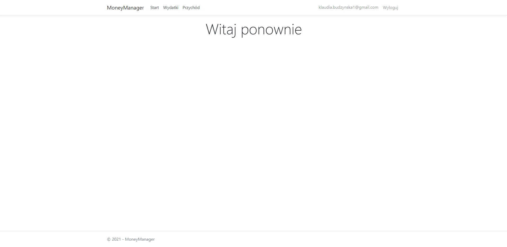
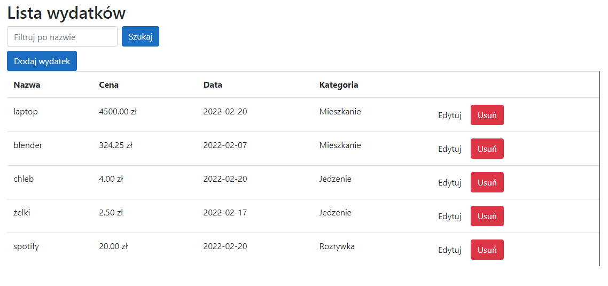

# MoneyManager

## Potrzebne do uruchomienia
* .net w wersji 5
* lokalna baza danych sql o nazwie "wallet" w instancji "money_manager"

## Fukncjonalności
### Autentykacja
Aplikacja umożliwia logowanie i rejestrację użytkowników. Funkcje te są dostępne z poziomu paska nawigacji. Funkcje są zrealizowane przy pomocy Identity.

Użytkownicy zapisani są w bazie danych i w wykorzystanych w projekcie tabelach "Expenses" i "Income" mają przypisane swoje rekordy.

Strona startowa dla użytkowników zalogowanych i niezalogowanych różni się treścią, oraz dostępnymi linkami w nawigacji

* Widok dla użytkownika niezalogowanego

* Widok dla użytkownika zalogowanego

### Wydatki
Użytkownik ma możliwość zarządzania swoimi wydatkami z poziomu interfejsu. Pojedynczy element posiada widoczną w interfejsie nazwę, kwotę, datę oraz kategorię. 
Możliwe jest dodawanie, edycja oraz usuwanie. Dane wejściowe są walidowane.

Na podstronie możliwe jest filtrowanie rekordów po nazwie wydatku

### Przychody
Podobnie jak w przypadku wydatków, użytkownik może zapisywać w aplikacji swoje przychody. Podawane są nazwa, kwota oraz data, również walidowane.

Na podstronie możliwe jest filtrowanie rekordów po nazwie przychodu

